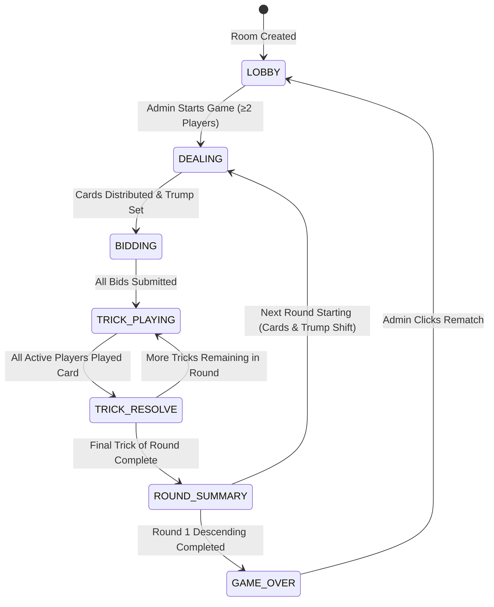

# Judgement Online — System Architecture & Design Document

> **Mode**: YC Office Hours (Builder Mode)  
> **Target Goal**: Remote browser-based card game for playing with friends  
> **Tech Stack**: React (Frontend) + Node.js with Socket.io (Backend)  
> **Core Architecture**: Clean Finite State Machine with Server Authoritative State & Reconnection Resilience  

---

## 1. Product Overview & Vision

**Judgement Online** is a real-time, browser-based multiplayer trick-taking card game based on the traditional Judgement rules. It allows friends to create private rooms, invite players via shareable room codes/links, and play rounds seamlessly with zero setup required.

### Key Highlights
- **Server-Authoritative State**: Prevents cheating and handles edge cases deterministically.
- **Reconnection Resilience**: Unique persistent Player IDs stored in `localStorage` allow players to seamlessly reconnect mid-game without losing hands or scores.
- **AFK / Disconnect Protection**: 20-second turn timers with automatic fallback play (lowest legal bid / lowest-risk legal card).
- **Dynamic Card Scaling**: Ascending phase (1 card → max cards) to Descending phase (max cards → 1 card) with automatic adjustment when players join or leave between rounds.

---

## 2. Refined Game Rules & Logic Specifications

Derived from [`new.md`](file:///d:/Judgement/new.md):

### 2.1 Deck & Card Ranking
- **Deck**: Standard 52-card deck (no jokers).
- **Card Hierarchy**: `Ace > King > Queen > Jack > 10 > 9 > 8 > 7 > 6 > 5 > 4 > 3 > 2`.
- **Trump Rotation**: Fixed sequence by round:  
  `♠ Spades → ♦ Diamonds → ♣ Clubs → ♥ Hearts → (Repeat)`

### 2.2 Dynamic Round & Player Scaling
- **Max Cards Formula**: `floor(52 / active_players)`
- **Ascending Phase**: Starts at 1 card and increases by 1 card per round.
- **Ascending → Descending Switch**:
  - At round end, the server calculates `next_card_count = current_card_count + 1` and evaluates `max_possible = floor(52 / next_active_players)`.
  - If `next_card_count <= max_possible`, ascending continues.
  - If `next_card_count > max_possible` (or if a new player joined making target card count impossible), **Ascending permanently locks**, and the game switches to **Descending**, setting `next_card_count = max_possible`.
  - Once Descending begins, it decreases by 1 card per round down to 1 card.

### 2.3 Bidding Rules & The Final Bidder Constraint
- Public, sequential bidding following the round's rotating player order.
- **Restriction**: `sum(all_bids_in_round) ≠ total_tricks_in_round`.
- **Final Bidder Constraint**: The last player to bid cannot choose `forbidden_bid = total_tricks - sum(previous_bids)`.
  - *Example*: In a 3-card round with bids `0` and `1`, sum = 1. The final bidder CANNOT bid `2` (since 1 + 2 = 3).
  - *Auto-play Fallback*: If the final bidder times out, the server picks the lowest legal bid (`>= 0`) that is NOT the `forbidden_bid`.
- **Mathematical Property**:
  - Since $\sum \text{bids} \neq \text{total\_tricks}$, but $\sum \text{tricks\_won} = \text{total\_tricks}$, **it is mathematically impossible for ALL players to hit their exact bids in the same round**. At least one player is guaranteed to fail their bid every round.

### 2.4 Trick Playing & Scoring
- **Lead**: The first bidder leads trick #1. Subsequent trick leaders are the winners of the previous trick.
- **Follow Suit**: Players must play a card of the led suit if held. If void, any card (including Trump) can be played.
- **Winning Trick**: Highest Trump wins; if no Trump played, highest card of the led suit wins.
- **Scoring**:
  - `bid > 0` and `tricks_won == bid`: `Score = bid * 10`
  - `bid == 0` and `tricks_won == 0`: `Score = 10`
  - Any mismatch (`tricks_won != bid`): `Score = 0`
- **Multiple Round Winners**: Multiple players (e.g. 2 out of 3, or 3 out of 4) can successfully hit their bids and earn points in the same round, but **never all active players**.

---

## 3. Server State Machine & Data Models

### 3.1 Room State Machine Diagram



### 3.2 Key Backend Data Schemas (JavaScript / TypeScript)

```javascript
// Room Object Schema
const RoomSchema = {
  roomId: "ROOM_CODE",          // 6-character alphanumeric code
  adminPlayerId: "UUID",        // Current room admin
  status: "LOBBY",              // LOBBY | DEALING | BIDDING | TRICK_PLAYING | TRICK_RESOLVE | ROUND_SUMMARY | GAME_OVER
  players: [
    {
      playerId: "UUID",
      nickname: "Alex",
      socketId: "socket_123",
      isOnline: true,
      isActiveInGame: true,    // True if in current round
      score: 40,
      hand: [],                 // [{ suit: 'SPADES', value: 14, id: 'S14' }]
      currentBid: null,
      tricksWon: 0,
      seatIndex: 0
    }
  ],
  gameConfig: {
    phase: "ASCENDING",         // ASCENDING | DESCENDING
    roundNumber: 1,
    cardsInRound: 1,
    trumpSuit: "SPADES",        // SPADES | DIAMONDS | CLUBS | HEARTS
    dealerIndex: 0,
    currentTurnIndex: 0
  },
  currentRound: {
    bids: { "UUID": 1 },
    forbiddenBidForFinalPlayer: null,
    currentTrick: {
      leadSuit: null,
      cardsPlayed: [            // [{ playerId: 'UUID', card: { suit, value } }]
      ]
    },
    tricksHistory: []
  },
  timer: {
    endsAt: 1690000000000,
    timeoutRef: null
  }
};
```

---

## 4. Real-Time WebSocket API Contract (Socket.io)

### 4.1 Client → Server Events
| Event Name | Payload | Description |
|---|---|---|
| `room:create` | `{ nickname }` | Creates a new room, assigns Admin role. |
| `room:join` | `{ roomId, nickname, playerId? }` | Joins an existing room or reconnects with existing `playerId`. |
| `game:start` | `{ roomId }` | Admin starts the game from LOBBY. |
| `game:bid` | `{ roomId, bid }` | Submits a bid during BIDDING phase. |
| `game:play_card` | `{ roomId, cardId }` | Plays a card during TRICK_PLAYING phase. |
| `game:rematch` | `{ roomId }` | Admin triggers rematch after GAME_OVER. |

### 4.2 Server → Client Events
| Event Name | Payload | Description |
|---|---|---|
| `room:state_update` | `{ roomState, clientPlayerId }` | Complete room snapshot (sanitized to only include client's own hand). |
| `game:turn_timer` | `{ secondsRemaining, playerId }` | Broadcasts active turn timer tick. |
| `game:error` | `{ message, code }` | Returns error (e.g. illegal card follow suit violation, forbidden bid). |
| `game:trick_won` | `{ winnerPlayerId, winningCard, trick }` | Broadcasts trick resolution pause. |
| `game:round_summary` | `{ scores, roundStats }` | Broadcasts end-of-round scores & adjustments. |

---

## 5. Reconnection & Auto-Play Algorithms

### 5.1 Reconnection Handling
1. On initial connection, client generates/retrieves `playerId` from `localStorage`.
2. When joining a room (`room:join`), client sends `playerId`.
3. If `playerId` matches an existing room player:
   - Server updates `player.socketId` and sets `player.isOnline = true`.
   - Server immediately emits `room:state_update` with sanitized current game state and existing hand.
   - Player resumes exact turn without disrupting game state.

### 5.2 Auto-Play Strategy (Server 20-Second Timeout)

```javascript
// Server-side Timeout Executor
function handleTurnTimeout(room) {
  const activePlayer = room.players[room.gameConfig.currentTurnIndex];
  
  if (room.status === 'BIDDING') {
    const legalBids = getLegalBids(room, activePlayer);
    const lowestBid = Math.min(...legalBids);
    processBid(room, activePlayer.playerId, lowestBid);
  } else if (room.status === 'TRICK_PLAYING') {
    const legalCards = getLegalCardsInHand(activePlayer.hand, room.currentRound.currentTrick.leadSuit);
    const lowestRiskCard = selectLowestRiskCard(legalCards, room);
    processPlayCard(room, activePlayer.playerId, lowestRiskCard.id);
  }
}

function getLegalBids(room, player) {
  const maxBid = room.gameConfig.cardsInRound;
  const isFinalBidder = isLastBidder(room, player);
  const totalTricks = room.gameConfig.cardsInRound;
  const currentSum = Object.values(room.currentRound.bids).reduce((a, b) => a + b, 0);
  const forbiddenBid = totalTricks - currentSum;
  
  const bids = [];
  for (let b = 0; b <= maxBid; b++) {
    if (!isFinalBidder || b !== forbiddenBid) {
      bids.push(b);
    }
  }
  return bids;
}
```

---

## 6. React Frontend Component Structure

```
src/
├── components/
│   ├── Lobby/
│   │   ├── CreateRoom.jsx
│   │   ├── JoinRoom.jsx
│   │   └── PlayerList.jsx
│   ├── Game/
│   │   ├── GameBoard.jsx          # Main table container
│   │   ├── PlayerSeat.jsx         # Shows player avatar, bid, tricks won, online indicator
│   │   ├── PlayingHand.jsx        # User's cards with hover & playable highlights
│   │   ├── Card.jsx               # SVG / CSS rendered playing card
│   │   ├── BiddingOverlay.jsx     # Interactive bid selector (disables forbidden bid)
│   │   ├── TrumpIndicator.jsx     # Active Trump icon & round info
│   │   ├── TurnTimerBar.jsx       # 20-second progress bar
│   │   └── ScoreboardModal.jsx    # Round-by-round scoreboard
│   └── Shared/
│       ├── ConnectionBadge.jsx
│       └── SoundEffects.jsx
├── context/
│   └── SocketContext.jsx          # Shared Socket.io provider
├── hooks/
│   └── useGameState.js            # Custom hook wrapping socket events
└── utils/
    └── cardUtils.js
```

---

## 7. Recommended Execution Plan

1. **Phase 1: Node.js Socket.io Server Engine**
   - Implement `RoomManager` with room creation, player seats, persistent UUIDs.
   - Build finite state machine for Bidding, Playing, Scoring, and Trump Rotation.
   - Implement final-bidder forbidden bid rule & 20s auto-play timers.

2. **Phase 2: React Frontend & Real-time Integration**
   - Scaffold React SPA with SocketContext.
   - Build Lobby, GameBoard, Interactive Bidding Selector, and Card Hand.
   - Connect WebSocket events and test multi-window room play.

3. **Phase 3: Visual Polish & Reconnection Verification**
   - Add card deal animations, trump badges, turn highlight glows, and score summary overlay.
   - Test disconnection / page refresh scenarios.

---

*Document generated via YC Office Hours skill (`office-hours`). Ready for implementation.*
